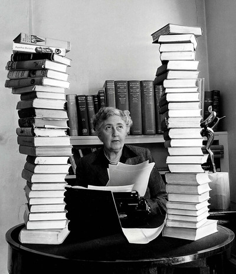

A couple of days ago I got [Rooms of Their Own: Where Great Writers Write](https://www.goodreads.com/book/show/58684333-rooms-of-their-own) as a gift for my name day celebration ([it's a thing](https://en.wikipedia.org/wiki/Name_day#Greece_and_Cyprus) in Greece). It's a book about famous authors, the spaces they wrote from, and their habits and daily rituals.

This is my kind of gossip. A peephole through which I can look at my favorite authors and learn about their idiosyncrasies. Of course I had to list here my favorite pieces of information. Off we go. 

- **Isabel Allende** starts every new novel on January 8, the date she wrote a letter to her dying grandfather back in the day, which evolved to be [The House of the Spirits](https://www.goodreads.com/book/show/9328.The_House_of_the_Spirits).

- **Margaret Atwood** wrote [The Handmaid’s Tale](https://www.goodreads.com/book/show/38447.The_Handmaid_s_Tale) in West Berlin where she lived for a year in 1984, before the Wall came down. She also came up with the idea of the first remote-signing device in 2004 (the [LongPen](https://en.wikipedia.org/wiki/LongPen)) and she has her own medium roast [coffee blend](https://balzacs.com/products/atwood-blend?variant=42118343557276).

- **Honoré de Balzac** had up to 50 cups of coffee a day and woke up to start writing at midnight (these two facts are obviously related).

- **Anton Chekhov** planted at his country estate outside of Moscow, a cherry orchard of 50 trees, which was cut down after he sold the estate in 1899. This event was probably the inspiration for Chekhov's last play [The Cherry Orchard](https://en.wikipedia.org/wiki/The_Cherry_Orchard) which he wrote in 1903.

  

- **Agatha Christie** is the best-selling novelist ever with over 2 billion copies sold. She would often work on two books simultaneously.

  

- **Charles Dickens** had rows of dummy bookcases with fake book spines in his London house in Doughty Street. Why Charles? Why?

- The [Emily Dickinson Museum](https://www.emilydickinsonmuseum.org/studio-sessions/) lets you experience what it was like to work in Emily's bedroom with two-hour slots in which you can be alone in the room to write. At the time of writing it was $300 for one hour and $500 for two. Apparently this is not the only experience of the sort. You can also write in Melville's study for $300 an hour, spend a few hours in Ernest Hemingway’s house in Key West Florida for $1,500, or spend three hours in Mark Twain’s library with other writers for $50.

- **Ian Fleming**, the James Bond creator, did most of his work in a holiday bungalow, complete with private beach and reef, in Jamaica. He travelled there January to March every year and knocked out a new Bond adventure on each trip. He had a lot of books there, including [The Field Guide to Birds of the West Indies](https://www.goodreads.com/book/show/960856.A_Field_Guide_to_the_Birds_of_the_West_Indies) by an ornithologist with the inspiring name of James Bond.

- Despite his reputation, **Ernest Hemingway** never drank while writing! Reader, this was the fact that shocked me the most. The "Write drunk, edit sober" poster that I had for years in my office proved to be a lie.

  

- **George Orwell** died a few months after [1984](https://www.goodreads.com/book/show/61439040-1984) was published (and was an instant hit) in 1949.

- It took 14 years for **Marcel Proust** to write his [In Search of Lost Time](https://www.goodreads.com/book/show/18796.In_Search_of_Lost_Time), during which he was in bed the whole time. He wasn't sick, he chose to isolate himself in his bedroom after his parents's death. His housekeeper provided him with his daily croissants (ooh la la) and hot coffee.

- The British novelist Vita Sackviandlle-West was the lover of **Virginia Woolf**, and her muse since Woolf's 1928 novel [Orlando](https://www.goodreads.com/book/show/18839.Orlando) was inspired by her. There is also a movie about the couple, [Vita & Virginia](https://www.imdb.com/title/tt5859882/).

  

- **Kurt Vonnegut** kept his rejection slips for his short stories from magazines. The best one is from The Atlantic Monthly in 1949 suggesting that his piece on the wartime destruction of Dresden - which Vonnegut experienced first hand - was _"not quite compelling enough"_. Feel free to pause here to let that sink in. The guy who wrote that is right up there with Ronald Wayne, who in 1976 sold his 10% stake in Apple for $800.

- **Edith Wharton** wrote mostly in bed and Vogue recreated this in a 2012 photoshoot, by iconic photographer Annie Leibovitz, in which Russian model Natalia Vodianova poses as Wharton. You can see all the photos [here](https://www.vogue.com/slideshow/edith-wharton-photos).

  

- John Steinbeck's Irish Setter, Toby, ate half of an early draft of [Of Mice and Men](https://www.goodreads.com/book/show/890.Of_Mice_and_Men). Steinbeck wrote on May 27, 1936:

  > Minor tragedy stalked. My setter pup, left alone one night, made confetti of about half of my manuscript book. Two months work to do over again. It set me back. There was no other draft. I was pretty mad, but the poor little fellow may have been acting critically. I didn’t want to ruin a good dog for a manuscript I’m not sure is good at all. He only got an ordinary spanking … I’m not sure Toby didn’t know what he was doing when he ate the first draft. I have promoted Toby-dog to be a lieutenant-colonel in charge of literature.

  

That's all my favorite bits from the book. If you made it that far you are into literature so go ahead and give this book a try. It's worth your time.
