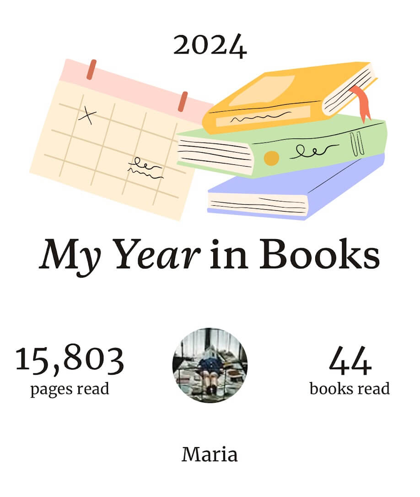
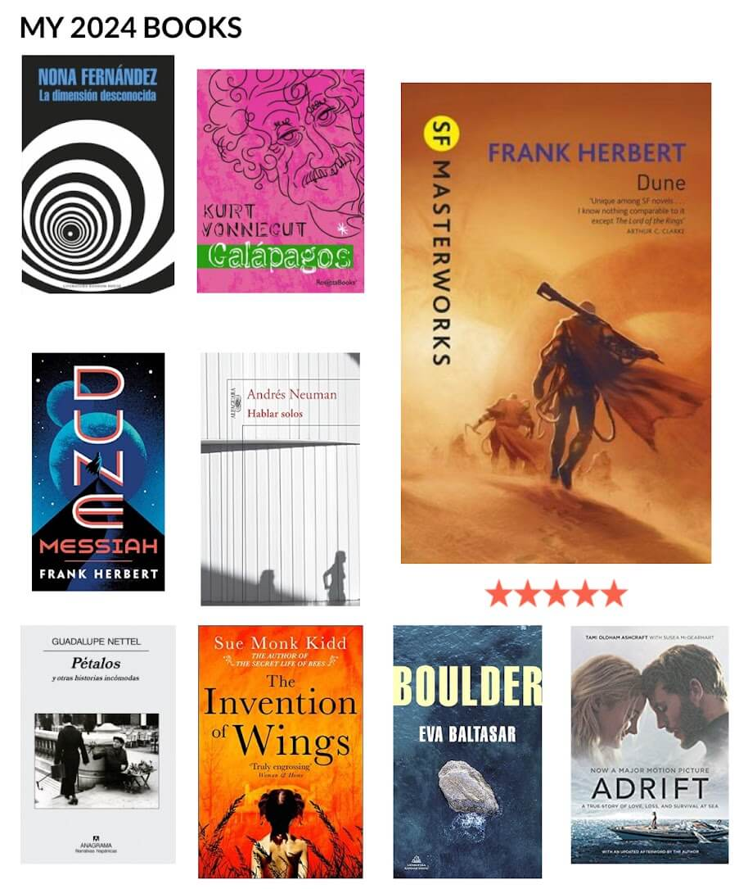
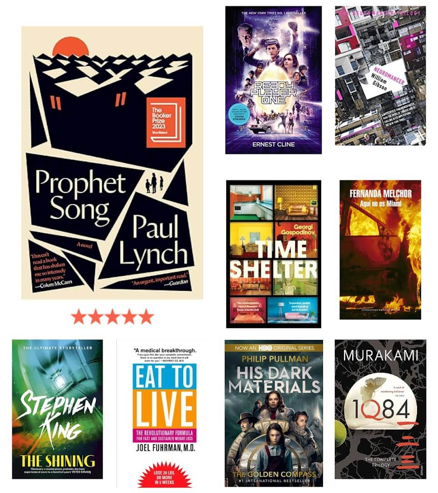
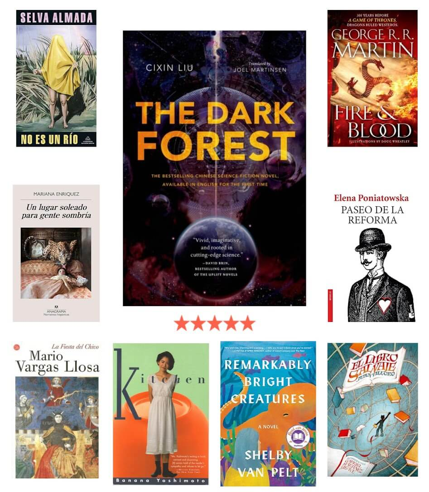
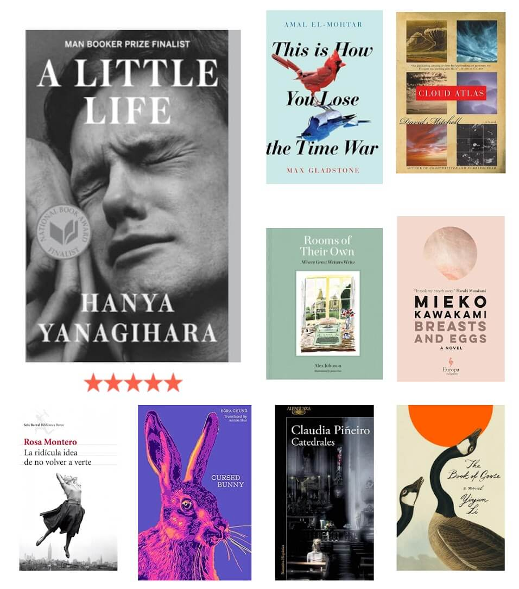
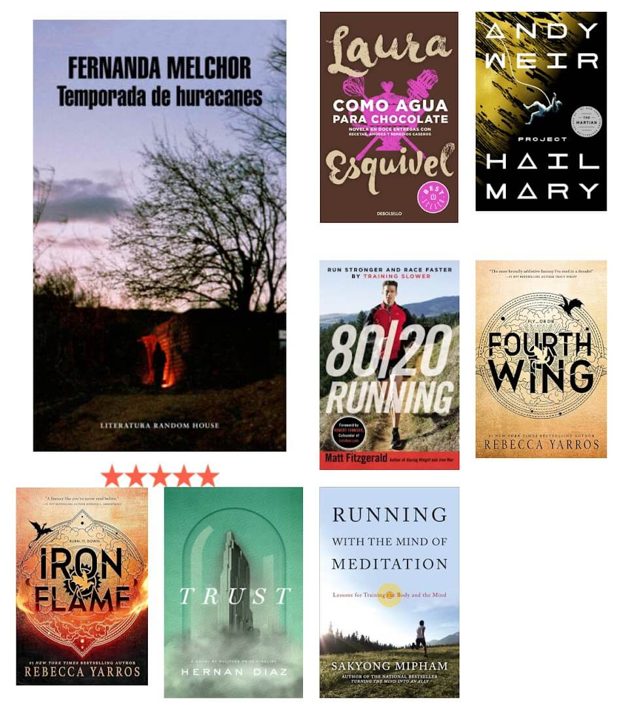

Let's start with some stats:
- I read 44 books: 30 in English and 14 in Spanish.
- Where were the authors from?
  - 18 from the Unites States.
  - 12 from Latin America (Mexico 6, Argentina 4, Chile 1, Peru 1)
  - 7 from Europe (UK 3, Spain 2, Ireland 1, Bulgaria 1)
  - 7 from Asia (Japan 3, China 2, South Korea 1, Tibet 1)
- Let's see the genres. I was surprised to realize that I read more non fiction than general fiction. The breakdown:
  - Science fiction 7
  - Non fiction 6
  - Fantasy 4
  - Fiction 4
  - Short stories 4 (counting Mariana Enriquez' work as both Horror and Short stories)
  - Horror 2
  - Dystopia 1
  - Historical fiction 1

Now let's see the amazing, the awful, and the disappointing ones.

### The reads I loved
- [Hablar solos, by Andrés Neuman](https://www.goodreads.com/book/show/16069329-hablar-solos). 5 stars. A heart-breaking story and beautiful writing. I loved every character and cared about them deeply. This book made me feel things.
- [A Little Life, by Hanya Yanagihara](https://www.goodreads.com/book/show/55711828-a-little-life). This book broke me. I lost count how many times I cried. There were points where I had to leave it on the side for a day or two because I couldn't stand the heartbreak from what I feared would happen next. I don't care if the story is unrealistic. I felt the characters' pain so deep that I will never forget it. And for that I thank Hanya Yanagihara 🙇🏻‍♀️.
- [Prophet song, by Paul Lynch](https://www.goodreads.com/book/show/200624156-prophet-song). I love a good dystopia. And this one is amazing. I cried a lot and lived the horror that Lynch portarayed. The novel won the Booker for 2023 and it was very much deserved. 5 stars.
- [Ready Player One, by Ernest Cline](https://www.goodreads.com/book/show/12359421-ready-player-one). Great sci-fi! I don't know how it took me so long to pick up this book, I had so much fun! Goes into my un-put-downable category. 5 stars.

- [The Dark Forest, by Liu Cixin](https://www.goodreads.com/book/show/23168817-the-dark-forest). Sequels usually don't deliver but this one did. Love the story and cannot wait to read the third book of the series. I hated the series though. I don't know what happened there and how they could mess this up but somehow they did.
- [La ridícula idea de no volver a verte, by Rosa Montero](https://www.goodreads.com/book/show/17567272-la-rid-cula-idea-de-no-volver-a-verte). What a great title! The ridiculous idea of not seeing you again ❤️. This was my first Montero book but definitely not the last. I loved her writing and cannot wait to read more from her.
- [Catedrales, by Claudia Piñeiro](https://www.goodreads.com/book/show/51735360-catedrales). I am a huge Piñeiro fan. I love every book of hers I read and this was no exception. Piñeiro uses the murder of a teenage girl to talk to us about religion, family, and faith. The point of the book is not who killed Ana, this is not a crime novel. You will suspect what happened pretty early in the book. But this takes nothing out of the experience. Piñeiro talks about important things in a mesmerising way. Piñeiro takes us into the heart of darkness and shows us how people do monstrous, inconceivable things. And the stories they tell themselves to survive them.
- [Temporada de huracanes, by Fernanda Melchor](https://www.goodreads.com/book/show/34847511-temporada-de-huracanes). This book has it all. It pulls you into the gutter of patriarchy and keeps you there for a while, until you've seen it all. If there is a horror you can imagine, Fernanda Melchor will make you live it. It's an important story, touching so many things, including life in rural México, where the majority of people live and die in poverty and misery. But what made the biggest impression on me was not the story, but the writing style. I don't think I can describe it easily because it feels like Melchor invented her own style and this is the only book that exists. It mixes so many things. The narrator changes so many times within the same sentence. Someone wrote for another book of Melchor that it was "written in a chilling torrent of prose" and this is the best description I can think of. It's a great achievement and a mind-blowing book from every aspect.
- [Fourth Wing, by Rebecca Yarros](https://www.goodreads.com/book/show/61431922-fourth-wing). Fantasy novels with a romantic twist is my guilty pleasure. And when there are dragons involved forget about it. And forget about me because I won't talk to you or work or even shower until I finish the book. Loved it!

### The books I hated with all my heart
- [Adrift by Tami Oldham Ashcraft](https://www.goodreads.com/book/show/38204050-adrift) 🤮 A survival story at sea. I picked this one up because I love sailing. I know that sailing memoirs are usually not the best writing you can find but this one was painful. I hated every minute of reading it and I wished that the character died so she could shut up and I can go on with my life. Really, really bad.
- [Neuromancer, by William Gibson](https://www.goodreads.com/book/show/29349974-neuromancer). I still cannot believe how much I hated this book. Copying from my Goodreads review: "I feel like I just read the delirium of someone on acid. Like on of those real crazy dreams that leave you wondering what's up with your unconscious. Most of the book made no sense and I struggled to finish it. Real bad writing, I have no idea what so many people liked about it."
- [Cloud Atlas, by David Mitchell](https://www.goodreads.com/book/show/49628.Cloud_Atlas). This is a no from me. It's not bad but I hated the execution. Reading this one was a drag. And throughout the book the question that persisted on my mind was, what's the fuss about? I went all the way to the last page to find an answer but was disappointed. The “Sloosha's Crossin' An' Ev'rythin' After” chapter took me almost two weeks to power through. Reading it was physically painful. And in the end not worth the effort.

### The disappointing
- [Boulder by Eva Baltasar](https://www.goodreads.com/book/show/53734105-boulder). I went into this with high expectations. I had read great reviews and the story resonated with me a lot. Sadly I didn't enjoy. The writing is beautiful but I couldn't care about any of the characters, which given that I identified with them in a lot of things, is quite an accomplishment.
- [Time shelter, by Georgi Gospodinov](https://www.goodreads.com/book/show/58495874-time-shelter). I picked this one up expecting to love it but nope. I'm rarely disappointed by Booker winners. This was one of the exceptions. I liked it at the beginning but the more I read the less I liked it. I struggled through the last part. Overall a good idea but I didn't like the execution.
- [This Is How You Lose the Time War, by Amal El-Mohtar and Max Gladstone](https://www.goodreads.com/book/show/43352954-this-is-how-you-lose-the-time-war). Let down again. The story has so much promise but the delivery did not satisfy me. I expected more than just a love story.
- [Breasts and eggs, by Mieko Kawakami](https://www.goodreads.com/book/show/50736031-breasts-and-eggs). I really wanted to love this book. But I was once again disappointed. What I hated the most was the ending (SPOILER ALERT!). What an easy way out. You go and write a book that addresses such hard topics and then you resolve everything with a prince charming. I found this romcom ending very disappointing, to the point of cancelling the whole book.
- [The Book of Goose, by Yiyun Li](https://www.goodreads.com/book/show/59808607-the-book-of-goose). I had my eye on this one for some time. The book started off great and the first half really had me hooked but then it ran out of steam. The writing became more and more lukewarm and the plot thinner with every chapter. Not impressed.

That's it! Stay tuned for more on the books I'm reading while I struggle to find some time between my long distance running and my full-time writing job! 😅