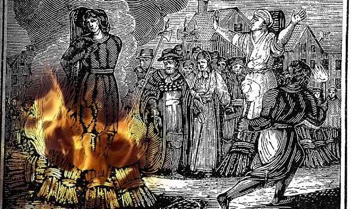
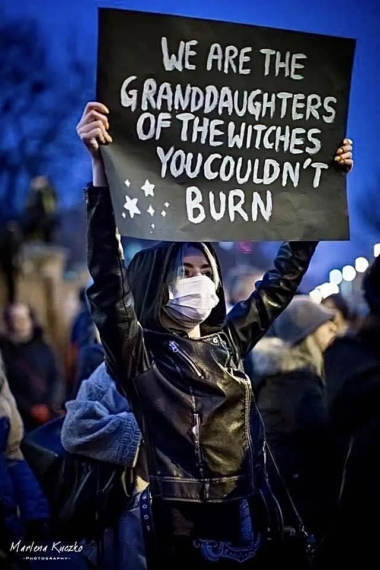

A few weeks ago I read on the news about the murder of Rebecca Cheptegei, a Ugandan cross-country, long-distance, and marathon runner. She was a former world champion in mountain running and competed in the 2024 Summer Olympics in Paris. She was 33 years old, and the mother of two children. She was murdered by her former partner, Dickson Ndiema Marangach, who doused her with petrol and set her alight.

He was waiting outside her house, with five liters of gasoline. She was at church, with her kids. When she returned, he doused her and set her on fire. He did it in front of her daughters. Rebecca died a few days later.

Dickson Ndiema Marangach murdered Rebecca Cheptegei over a land dispute in Kenya. Does this sound familiar? Maybe it does. Perhaps you have heard about the hundreds of thousands of women who were burnt at the stake, accused as witches, while very often the reason for their execution was that the government wanted to seize their property. They say that all the women who were hanged as witches in Salem in 1692 were killed for that reason.

And women are still burned every day.

In Pakistan, hundreds of women die every year, killed by their husbands or their husbands’ families. Burning is the preferred method because the chances of prosecution are smaller. Some families will claim that a wife was killed by an exploding stove or another burning accident so charges are rarely filled.

In India, brides are murdered by their husbands or their husbands’ families if the bride's family refuses to pay additional dowry. The wife is typically doused with kerosene, gasoline, or other flammable liquid, and set alight. Again, this method allows the claim that the crime was an accident. Around **2500 women are burned alive in India every year**, and this number is based only on the reports, so as you can imagine the real number must be way higher.

And let's not forget about the lesbian women set on fire in Argentina earlier this year. Three women died after a man threw a Molotov cocktail into their boarding house room on May 6, setting them all on fire.

The sheer amount of women killed over the years in this way is chilling. Let's hope that we will live to see the day that instead of women it will be the patriarchy burning at the stake.

