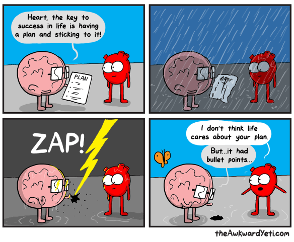
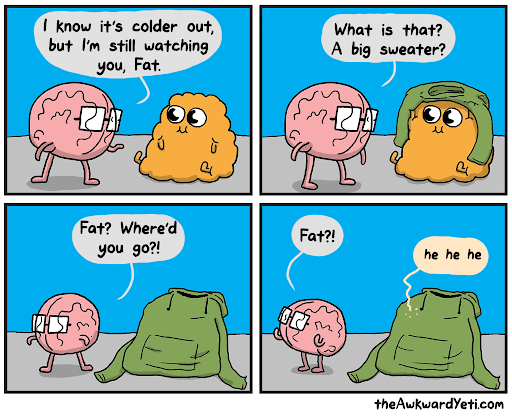
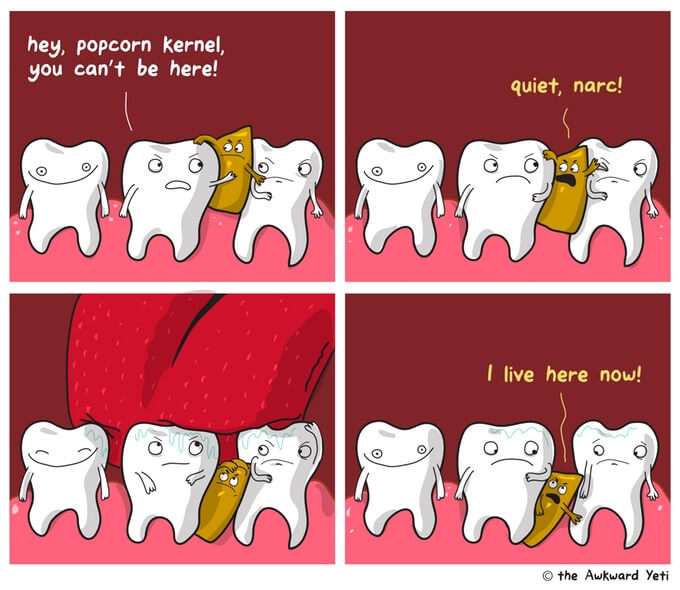
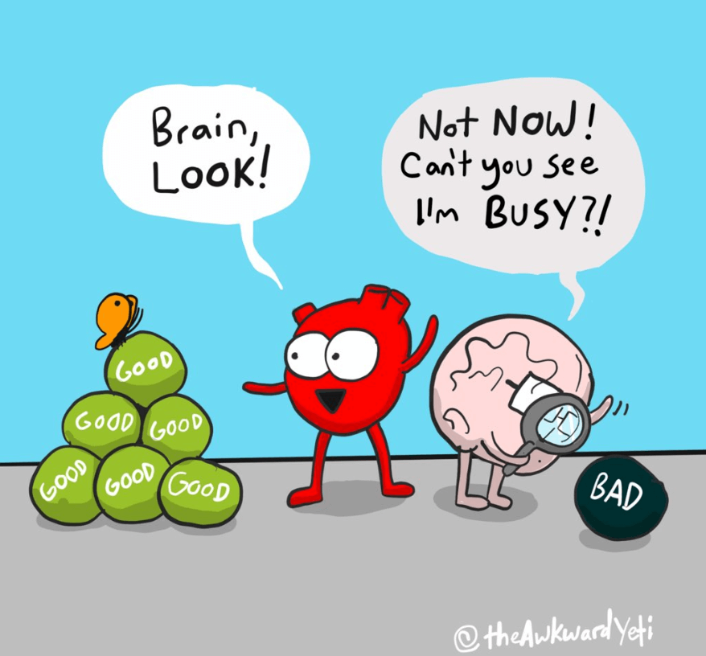
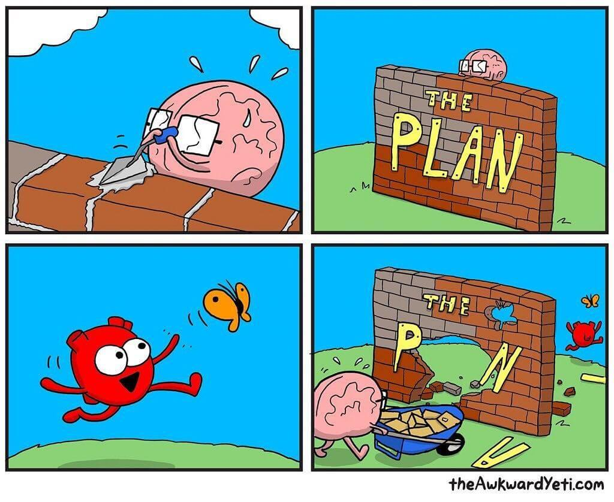

My favorite accounts on social media are all artists, mostly illustrators and cartoonists.

I'm gonna use my blog to present some of my favorite ones, starting with: The Awkward Yeti.

The Awkward Yeti is a webcomic that follows the daily life of the blue yeti Lars. The creator, Nick Seluk, started a few spin-off comics based on it, and my absolute favorite is Heart and Brain, a webcomic where your organs get their own voices.

## Support the artists you like

When I find an artist I like, and follow them online for some time (for free), I go ahead and buy at least one of their books. This way I give back and support the artist so they can keep on doing what they do best.

The one I bought from this artist is [Heart and Brain : An Awkward Yeti Collection](https://www.bookdepository.com/Heart-Brain-Awkward-Yeti/9781449470890?ref=grid-view&qid=1583173675161&sr=1-1). Consider doing the same.

Here are some Awkward Yeti links:

- [Instagram account](https://www.instagram.com/theawkwardyeti/)
- [Twitter account](https://twitter.com/theawkwardyeti)
- [Online store](https://theawkwardstore.com/)
- [Books at Book Depository](https://www.bookdepository.com/author/The-Awkward-Yeti)
