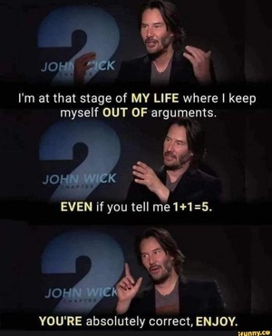
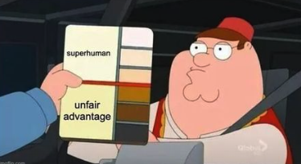
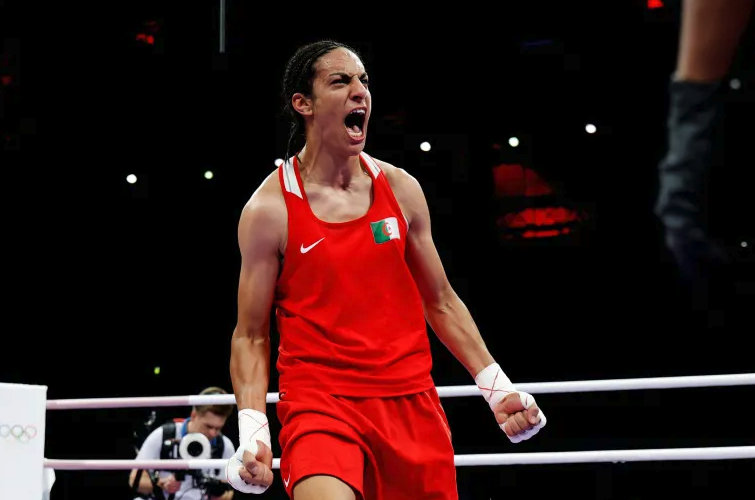

The past couple of days Earth's netizens have been upset and very vocal about it. What else is new, right?

I'm usually pretty good at ignoring the online world and the things they care and fight about. I embrace a Keanu Reeves approach to people's bickering online: I simply avoid arguing.

But I cannot stop myself when it comes to equality and discrimination. I am talking of course about Imane Khelif.

Imane Khelif is an Algerian female boxer who participates in this year's Olympics. All hell broke loose when she beat Italy's Angela Carini within 46 seconds. Carini took a punch, forfate the game, and started crying. She refused to shake Khelif's hand and proceeded to doubt whether Khelif should be allowed to compete.

Many people took her side and rushed to point out that the Algerian boxer failed a gender eligibility test at the World Boxing Championships in 2023. People talked about her increased testosterone levels and the fact that she has XY chromosomes and is therefore a man.

How much of this is actually true? None of it.

The gender eligibility test that they talk about is to this day a secret test that the International Boxing Association (IBA) administered. The president of IBA, Umar Kremlev, said that Khelif was "proven" to have XY chromosomes. Unfortunately for the rest of the world, including International Olympic Committee (IOC), the IBA refuses to this day to share any information about the kind of test they did. So this argument relies on the credibility of the Russian-governed IBA, and the "secret test" they performed three days after Khelif kick a Russian's athletes butt in the semi-final.

So there is absolutely zero evidence that Khelif is transgender (she couldn't be either way as an athlete representing Algeria since it's illegal), nor intersex. And yet everyone is running their mouth, including J.K. Rowling who called Khelif "a man" and a "bullying cheat".

This is not the first time, nor will it be the last, that a competent female athlete is called a man. Serena Williams comes to mind, among others. And if you pay attention it's almost always women of color. If you don't look feminine enough, or you compete way better that the others, suddenly you need to show your genitals and take a DNA test. This is a dangerous mindset and it does not protect women, no matter how much some people try to convince us that this is what they are trying to do.

Does Khelif has any kind of biological advantage over the other boxers? I don't know, because unlike J.K. Rowling I'm not a boxing expert. But let's say she does. Isn't this part of sports? Haven't genetics always played a part in sports and people's success? Aren't we all tired of hearing about Michael Phelps's wingspan? Should he give his medals back because biologically he has an advantage over his competitors? Of course not. He is a man. He can just be a gifted athlete. While extraordinary gifted female athlets are just men I suppose. Especially if they are darker and have to compete with white women's tears.

I hope Imane Khelif wins the gold medal. And that she makes a lot of money out of suing everyone for defamation.

August 17 update: She did win the gold metal. And she did sue J.K. Rowling and Elon Musk for defamation!
