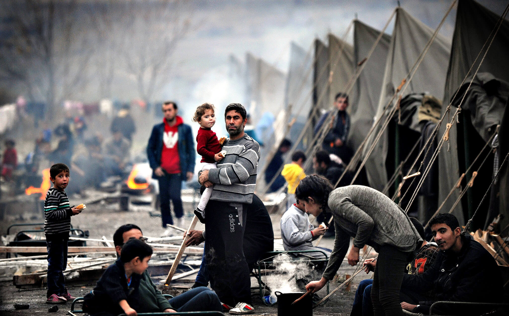

> Imagine that coronavirus spreads in Europe in an uncontrollable way, while on the African continent, due to the climatic conditions, it has no incidence. Terrified, European families would hysterically escape the disease on their way to the African border. They would try to cross the sea through the Gibraltar Strait, they would take dangerous boats from the Greek islands and the Turkish coast. Chased by the shadow of a new deadly plague, they would try to get to safety, driven by need. But upon reaching the African coast, they would face the same fences they erected, the same violent controls and the most impregnable borders. The North African forces of order would shoot at the Westerners without mercy. They would yell at them: "Go home! Leave us alone! We don't want your disease, your misery, your need." If the scriptwriters wanted to take cruelty to the extreme, they would allow some Europeans, led by the extortion gangs, to reach African destinations. There they would lock them up in inhospitable quarantines, where they would be stripped of their belongings, their affections, their dignity."
>
> ~ David Trueba, El Pais

[Image Source](https://theglobepost.com/2020/02/28/coronavirus-outbreak-refugees/)

Original text (in spanish): [La distopía nuestra de cada día](https://elpais.com/elpais/2020/03/09/opinion/1583761497_924258.html).
