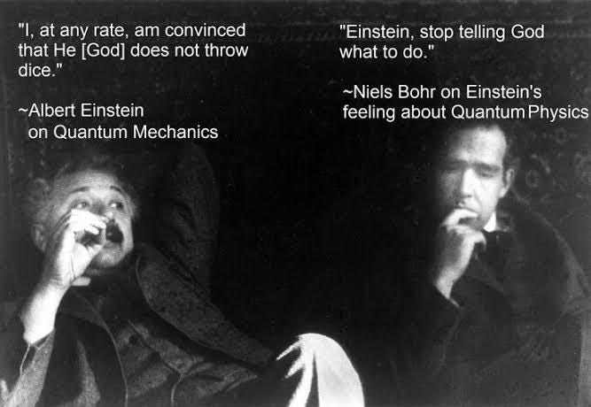
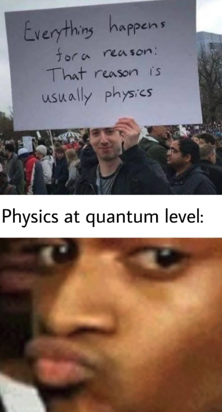

> TL;DR No.

We all know the phrase. "God does not play dice with the universe."

That was Albert Einstein's response to Niels Bohr over the emerging theory of quantum mechanics. You see, quantum theory is by nature probabilistic and random. And we humans do not feel good about randomness. Even those amongst us with an IQ of 160.

That's all good and fair. But when one of the most famous scientists in the world evokes a Deity, people will not let that slide. The quote has been used since as proof that Einstein believed in a traditional, religious, deity (he did not). Einstein had declared himself an agnostic but that didn't matter to those that wanted cool people on their side.

Even if Einstein was religious in a traditional sense (after all, many accomplished scientists have been), that would still prove nothing (and don't even get me started on the concept of "proving" that God exists; if that could be done faith would not be required). Einstein was a genius and a great scientist but the list of things he was wrong about is long. No one is always right (except for my wife, or at least, that’s what I’m instructed to say).

Leaving all this aside, it just makes sense to me that Einstein did not like quantum mechanics. Who would prefer probabilities over certainties? Chaos and randomness over order and the idea of a universe working like clockwork? Chaos and randomness are scary and we have been taught from a young age that the world works based on very specific rules that always apply. If you do A you get B.

Yet in the quantum world, A doesn’t promise B. 
B is just one probability. Sometimes A and B are connected in ways we can’t see, as if the universe keeps some of its rules hidden behind the curtain. Quantum Entanglement shows us that order and chaos might just be two sides of the same coin, and that **certainty itself might be an illusion**.

No wonder Einstein called Quantum Entanglemtn “spooky”. It breaks all the rules we grew up believing in.

I don't know if Einstein's world would be nice or even remotely interesting (unless you are German or Swiss), but I know it's not the world we live in.\
"God" does play dice.\
Not because a mean deity feels like, but because **our choices are half chance**.\
And we better remember that when we feel all powerful or all weak.

`youtube: kM7nykbnbaE`