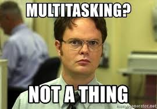

> TL;DR Rather than getting more done faster, you get worse results slower.

Some time ago I watched a LinkedIn course on [Time Management Fundamentals](https://www.linkedin.com/learning/time-management-fundamentals?u=2171756). The instructor, wanting to show how **multitasking is a productivity myth which results in worse results**, asked us to do the following exercise.

1. Get a piece of paper
1. Have a timer ready
1. After you start the timer, write in the first row "Switchtasking is a thief". After that, write to the second row the numbers 1–21
1. Ready, set, go! Do step 3 and count with the timer the total time it took you to write both lines. Write down the time
1. Go ahead and do it, don't just read what I write. The whole thing won't take more than 2 minutes of your time, I promise
1. Reset your timer and get ready for the second test
1. Do the same thing, write in the first row "Switchtasking is a thief" and in the second the numbers 1–21. But this time for every letter you write in the 1st row, switch to the 2nd row and write the corresponding number.
1. Ready, set, go! Do step 7 and count with the timer the total time it took you to write both lines. Write down the time
1. Compare the time to completion between these two passes and weep

My times were **24.8** for the first pass and **47.11** seconds for the second.

Rather than getting more done faster with multitasking, I got **worse results slower**.

This happens because our brain is **physically incapable** of handling multiple active tasks at the same time. I've only seen this kind of multitasking once and it was in a parallel computing class.

